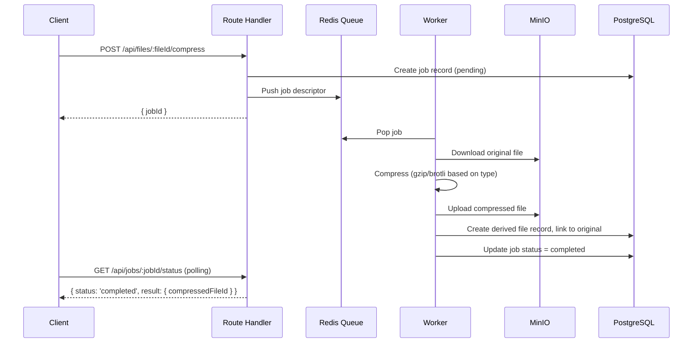

# Plan 04 — Background Jobs & Advanced Operations

> **Phase**: 4 (Advanced Operations)
> **Dependencies**: Phase 2 (Storage), Phase 3 (Metadata)
> **Estimated Duration**: 2 weeks

---

## 1. Background Job Infrastructure

### 1.1 Job Queue Architecture

Redis-backed list queue for async operations that cannot block HTTP requests.

**Components**:
- **Producer**: Route handlers push job descriptors onto Redis list
- **Worker**: Long-running Node.js process pops jobs and executes
- **Status Store**: Redis holds in-progress state; PostgreSQL holds final results

```
Producer → RPUSH job:{queue} {jobDescriptor} → Worker BLPOP → Execute → Write result to PostgreSQL → Clear Redis state
```

### 1.2 Job Descriptor Schema

```typescript
interface JobDescriptor {
  id: string;           // UUID
  type: 'ttl_cleanup' | 'bulk_archive' | 'file_compress';
  payload: Record<string, unknown>;
  createdAt: string;
  createdBy: string;    // userId or 'system'
  attempt: number;
  maxAttempts: number;
}
```

### 1.3 Job Status Table

```sql
CREATE TABLE jobs (
  id          UUID PRIMARY KEY,
  type        VARCHAR(50) NOT NULL,
  status      VARCHAR(20) NOT NULL DEFAULT 'pending'
              CHECK (status IN ('pending','processing','completed','failed','dead')),
  payload     JSONB NOT NULL,
  result      JSONB,
  error       TEXT,
  attempt     INTEGER NOT NULL DEFAULT 0,
  max_attempts INTEGER NOT NULL DEFAULT 3,
  created_by  UUID REFERENCES users(id) ON DELETE SET NULL,
  created_at  TIMESTAMPTZ NOT NULL DEFAULT now(),
  started_at  TIMESTAMPTZ,
  completed_at TIMESTAMPTZ
);

CREATE INDEX idx_jobs_status ON jobs(status, created_at);
CREATE INDEX idx_jobs_type ON jobs(type, status);
```

### 1.4 Retry & Dead-Letter

- Failed jobs retried with **exponential backoff**: `delay = baseDelay * 2^attempt` (base: 5s)
- After `max_attempts` exceeded → status set to `dead`, moved to dead-letter queue
- Dead-letter jobs visible to superadmin in admin panel for manual review
- Redis key for retry delay: `job:retry:{jobId}` with TTL = backoff duration

### 1.5 Job Status Polling

```
GET /api/jobs/:jobId/status

Response: {
  id: string,
  type: string,
  status: 'pending' | 'processing' | 'completed' | 'failed' | 'dead',
  progress?: number,   // 0-100 (for bulk operations)
  result?: object,     // available when completed
  error?: string       // available when failed/dead
}
```

Redis holds real-time status at `job:status:{jobId}` for fast polling. On completion, result written to PostgreSQL and Redis key cleared.

---

## 2. TTL Expiry & File Cleanup

### 2.1 Cron Job

**Trigger**: Next.js cron route handler, runs every 15 minutes.

**File**: `src/app/api/cron/ttl-cleanup/route.ts`

**Logic**:

```
1. Query file_configs WHERE ttl_expires_at <= now() AND file.is_deleted = false
2. For each expired file:
   a. Set files.is_deleted = true, files.deleted_at = now()
   b. Write audit log entry
3. Query files WHERE is_deleted = true AND deleted_at <= now() - GRACE_PERIOD
4. For each grace-period-expired file:
   a. Delete from MinIO via StorageService
   b. Hard-delete from PostgreSQL (CASCADE removes configs, tags, mentions, notes)
   c. Write audit log entry
```

**Grace Period**: 30 days (configurable via env `FILE_DELETION_GRACE_DAYS`)

**Auth**: Cron endpoint protected by a shared secret header (`X-Cron-Secret`)

### 2.2 Superadmin Recovery

- During grace period: `POST /api/files/:fileId/recover` sets `is_deleted = false`
- After grace period: file is permanently gone (MinIO + PostgreSQL)

---

## 3. Server-Side File Compression

### 3.1 Compression Flow



### 3.2 Compression Rules

| File Type | Algorithm | Notes |
|---|---|---|
| Text-based (txt, csv, json, xml) | gzip | High compression ratio |
| Images (png, bmp) | gzip | Moderate ratio; skip already-compressed formats (jpg, webp) |
| Already compressed (zip, gz, mp4) | Skip | Return error — no benefit |
| All others | gzip | Default |

### 3.3 Derived File Relationship

```sql
ALTER TABLE files ADD COLUMN derived_from UUID REFERENCES files(id) ON DELETE SET NULL;
ALTER TABLE files ADD COLUMN derivation_type VARCHAR(20);
-- derivation_type: 'compressed', 'archive', NULL (original)
```

- Original file **always preserved** unless user explicitly replaces
- User can choose which version to make canonical
- Both original and compressed visible in file metadata

### 3.4 API

```
POST /api/files/:fileId/compress
Response: { jobId: string }

-- Then poll:
GET /api/jobs/:jobId/status
```

---

## 4. Bulk Download

### 4.1 Small Selections (≤ 10 files, ≤ 100MB total)

Synchronous streaming archive:

```
POST /api/files/bulk-download
Body: { fileIds: string[] }

Response: application/zip stream
Headers:
  Content-Disposition: attachment; filename="download.zip"
  Content-Type: application/zip
```

- Each file's permission validated individually
- Excluded files listed in manifest file inside the archive
- Archive assembled by streaming from MinIO through compression stream to client
- **No disk writes** on app server

### 4.2 Large Selections (> 10 files or > 100MB)

Async job-based:

```
POST /api/files/bulk-download
Body: { fileIds: string[] }

Response: { jobId: string }  (when selection exceeds threshold)
```

1. Job created, pushed to queue
2. Worker assembles archive, writes to MinIO temp bucket
3. On completion, generates short-lived presigned URL (TTL: 1 hour)
4. Client polls `GET /api/jobs/:jobId/status` → receives download URL
5. Temp archive auto-deleted from MinIO after TTL

### 4.3 Archive Manifest

Every bulk download archive includes `_manifest.json`:

```json
{
  "included": [
    { "id": "...", "name": "report.pdf", "size": 12345 }
  ],
  "excluded": [
    { "id": "...", "name": "secret.doc", "reason": "Permission denied" }
  ],
  "generatedAt": "2026-05-19T14:00:00Z",
  "generatedBy": "user-uuid"
}
```

---

## 5. File Structure (Phase 4)

```
src/
├── app/api/
│   ├── files/
│   │   ├── [fileId]/compress/route.ts
│   │   └── bulk-download/route.ts
│   ├── jobs/
│   │   └── [jobId]/status/route.ts
│   └── cron/
│       └── ttl-cleanup/route.ts
├── lib/
│   ├── jobs/
│   │   ├── queue.ts              # Redis queue producer/consumer
│   │   ├── worker.ts             # Job worker process
│   │   ├── handlers/
│   │   │   ├── ttl-cleanup.ts
│   │   │   ├── compress.ts
│   │   │   └── bulk-archive.ts
│   │   └── types.ts
│   └── compression.ts            # Compression algorithm selection
└── db/schema/
    └── jobs.ts
```

---

## 6. Worker Process

The worker is a **separate Node.js process** (not a Next.js route):

```
src/worker.ts  →  Entry point
```

- Uses `BLPOP` on Redis queue lists (blocking pop, waits for work)
- Runs continuously in Docker alongside the Next.js app
- Handles all job types via type-dispatched handler registry
- Graceful shutdown on SIGTERM (finish current job, don't pop new ones)

**Docker Compose** addition:
```yaml
worker:
  build: .
  command: node dist/worker.js
  depends_on: [redis, minio, postgres]
  environment: *app-env
```

---

## 7. Verification Plan

- **TTL**: Set short TTL → wait → verify soft-delete → wait grace → verify hard-delete + MinIO removal
- **Compression**: Compress text file → verify compressed version created → verify original preserved
- **Skip compression**: Attempt to compress .zip → verify error returned
- **Bulk sync**: Select ≤10 small files → verify streaming zip download
- **Bulk async**: Select >10 files → verify job created → poll → download from presigned URL
- **Manifest**: Include inaccessible file in bulk request → verify manifest shows exclusion
- **Retry**: Force job failure → verify retry with backoff → verify dead-letter after max attempts
- **Worker**: Kill worker mid-job → restart → verify job is retried
